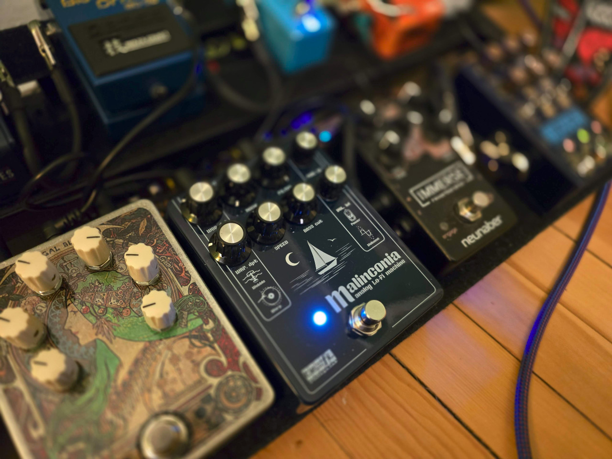
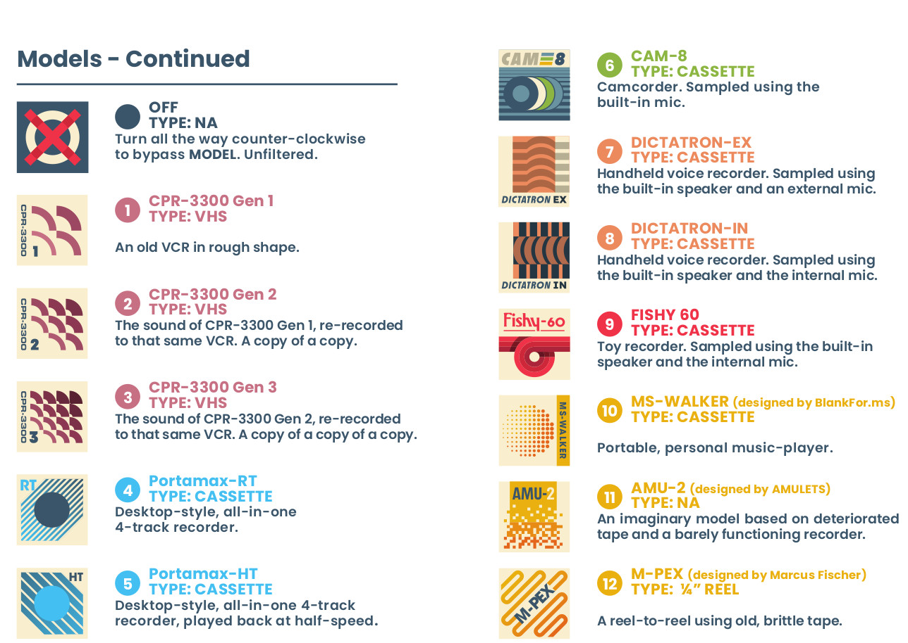

I'm now the owner of Malinconia #103, so since there are so few of them out in the wild, and being
that it cost around $400, I thought I'd better tell you what it's like.

I love lo-fi music in general, and lo-fi guitar pedals have always had a special place in my heart,
ever since the ZVEX Instant Lofi Junky became only the third guitar pedal I ever owned. Excluding
"lo-fi" delay and reverb effects like the Digitech Obscura or Caroline Météore, and also not
counting effects like the Strymon Deco which are "vintage" or maybe nostalgic but not exactly in the
"warbly lo-fi" genre that I'm most fond of, I've still owned quite a few:

- [ZVEX Instant Lofi Junky](https://www.zvex.com/guitar-pedals/instant-lo-fi-junky-guitar-effects-pedal)
- [Fairfield Shallow Water](https://fairfieldcircuitry.com/products/shallow-water)
- [Walrus Mako M1](https://www.walrusaudio.com/products/mako-series-m1-high-fidelity-modulation-machine?variant=42069616918763)
- [Chase Bliss Generation Loss mk2](https://www.chasebliss.com/generation-loss-mkii)
- [Kinotone Ribbons](https://kinotoneaudio.com/products/ribbons/)
- [Chase Bliss Lossy](https://www.chasebliss.com/lossy)
- [Hologram Chroma Console](https://www.hologramelectronics.com/chroma-console)
- and now the [TEFI Vintage Lab Malinconia](https://tefivintagelab.it/)

Let's give each of these some brief discussion and a rating. The ratings will go on a scale from 0
to 4 in honor of Roger Ebert. Factors that I care about include beautifulness, composability with
other effects / subtlety, return-on-investment with regard to price, and ROI with regard to amperage
from my pedalboard. Let's go in the order in which I tried them.

## ZVEX Instant Lofi Junky

I mentioned that I'm nostalgic for this pedal since it was one of my first ones, but it's a pretty
boozy effect. There is no subtlety possible with the Lofi Junky whatsoever. It does sound nice. 2/4.

## Fairfield Shallow Water

This is a darling of the boutique effect pedals community, and the trademark Fairfield minimalist
design is gorgeous and works well for the lo-fi theme, but when it comes to sound, something about
it just hurts my ears. There's a guy named Knobs whose (wonderful)
[review](https://www.youtube.com/watch?v=sYWuTmgVU9k) of this pedal calls it "the water bed of the
heart", but to me it just sounds like my amp is trapped inside a water bed. Like the Lofi Junky, my
experience is that this pedal is also not capable of subtlety at all; it's either off or it is a
huge, wet blanket on top of your tone. 2/4.

## Walrus Mako M1

The M1 is problematic but kind of great. It does a lot, delivering chorus, phaser, tremolo, vibrato,
[rotary](https://en.wikipedia.org/wiki/Leslie_speaker), and filter effects.

Actually, it comes with 3 subvarieties of each of those six effect classes, each of which is
distinct and interesting:

- Chorus
    - Traditional Chorus
    - Series Chorus
    - Tri-Chorus
- Phaser
    - 2-Stage Phaser
    - 4-Stage Phaser
    - Univibe Tuned Phaser
- Tremolo
    - Traditional Tremolo
    - Harmonic Tremolo
    - Pattern Tremolo
- Vibrato
    - Traditional Vibrato
    - Vinyl Vibrato
    - Tape Vibrato
- Rotary
    - Horn + Drum (Traditional Rotary Speaker)
    - Horn Only
    - Drum Only
- Filter
    - Lowpass Filter
    - Highpass Filter
    - Bandpass Filter

Plus it has a "lo-fi" knob that controls six additional effects: "env" (tone jumps responding to how
hard you play), "drive", "space" (reverb), "age" (a tape age effect), "noise", and "warble". Plus
there are six modulation parameters, plus the pedal supports presets...

The pedal is a case study in how hard it is to design an effect pedal's physical interface, because
the pedal has so many features and only 11 controls total. For example, the "Tweak" knob is in
charge of six settings total - "shape", "dive", "type" (referring to the subvarieties that I
mentioned above), "env", "drive", and "space" - which of the six settings the knob controls is
determined by a three-position switch below the knob, combined with whether or not the "Bypass /
Lo-fi" footswitch is being held.

So the interface is a bit bananas, and, like the other two I've discussed so far, the pedal is a
tone suck (in most configurations). Also, it requires a lot of power (300 mA minimum). But:

- The "univibe-tuned phaser" setting rocks; it's no worse than the Strymon Ultraviolet which costs
  basically as much as this pedal does
- The chorus (especially the trichorus) isn't bad
- The out-of-the-box presets give you a great way to explore all this and easily switch between them
  all, once you learn how to use them
- The vibrato settings (preset 2-red) with the lo-fi knob turned up a bit are a wonderful lo-fi
  effect, reminiscent of the Lofi Junky and in fact the Malinconia
- The harmonic tremolo and 2-stage and 4-stage phaser settings aren't bad at all

You just get so much for your money (especially now that the M1 mk2 is out, which I'm not interested
in because I don't like pedals with screens). This thing is $200! 4/4.

## Chase Bliss Generation Loss mk2

I was excited about this one, having had great experiences with my other CBA pedals, and it is
indeed a great time.

Chase Bliss is known for - since their typical pedal ships with 6 knobs, 3-5 switches, two buttons,
and 12 or so "dipswitches" on the back of the case - making pedals that contain a lot of complexity.
But over time, as I've been playing guitar, I've started to appreciate pedals that I can "set and
forget" and that, at a glance, I can have a pretty good idea what it's going to sound like when I
step on it and turn it on. The Gen Loss kind of has this property! It's an ergonomic, good-sounding
lo-fi pedal.

I just couldn't stop thinking about what else that $400 could buy if I sold or traded this pedal.
(The $350 I quoted above is its market rate now, but I pre-ordered the Gen Loss from Chase
themselves, and I think I sold or traded it for about the same). 

One of my big complaints about this pedal is that it comes with 12 "models" of tape degradation,
each of which has been effortfully crafted (Chase Bliss put out all kinds of great YouTube and
Instagram content showing their capturing sounds from real VCRs and Fisher-Price toys and so on) and
beautifully described in the manual; but the actual knob on the pedal that selects from these 12
models doesn't even have tick marks to show which model you have selected. If you want model #4
("Desktop-style, all-in-one 4-track recorder"), you just have to do your best to turn the knob 4/12
of the way through its range and hope you got the right one. What's the point of so much specificity
if you're never even going to be totally sure what you're getting? Why not just label the pedal's
range with tick marks, like on the Chase Bliss Thermae?

3/4.

## Kinotone Ribbons

Ribbons is a particularly boutique pedal from an up-and-coming studio Kinotone, but it's absolutely
packed with features. It's not "just" a lo-fi pedal, although most of its features pertain at least
loosely to the theme of "lo-fi and tape emulation".

- Extremely clever UI design: You know how some pedals, like Red Panda, have a
  "Shift" button that adds alternative functions to the knobs? The benefit is
  that you get twice as many knob effects for the same housing. (But the
  drawback is that you can't just look at a knob and know for sure what its
  settings is set to, and the Ribbons has this drawback). But the Ribbons
  doesn't just have "secondary" knob functions; instead it has four "Pages" of
  knob functions which you can toggle between.
  - Additionally it has eight preset slots, with some pretty boozy default
    presets that do a good job of showcasing the different sounds that the pedal
    is capable of.
  - Additionally it has a four-track looper, which has its own "Page" of four
    knobs to control. You can pitch-shift the loops up or down and slow or speed
    them up, like the CBA Blooper!
  - Low-pass and high-pass filter knobs
  - Mix knob
  - Compressor. Deserves special mention - REALLY good sounding compression
    effect, comparable to the best other compressor that I have tried.
  - Wobble depth and rate knobs. This can function as a vibrato or as a chorus
    (if you turn down Mix), and also deserves special mention as a wonderful,
    musical effect that sounds good in loads of different configurations.
  - Flutter depth and rate knobs. (Meh).
  - Dropouts depth and rate knobs - "the effect of tape getting stuck momentarily and then catching up."
  - Crinkle - momentary silences. (No depth & rate, just one knob.)
  - Noise - the 7 o'clock to noon side of this knob gets you a radio static
    sound, whereas the noon to 5 side gets you (delightful) record player pops.
  - Reverb depth - can be pre-effects (left side of depth knob) or post (right
    side) - and mix
  - and then the final two knobs control various parameters for the _four_
    different modes of the pedal's second button, which are called Touch Modes. For example (there
    are six total after a firmware update):
    - a microlooper similar to the Chase MOOD's "tape" effect
    - a "tape stop" effect that's also highly configurable and surprisingly musical & fun

I was breathless at how much features are packed into this device. I ultimately did not hang on to
it, as for whatever reason, one day, it just no longer sparked joy, but it sets a high bar for both
the high number of its various features and the polished beauty of its sounds. 4/4.

## Chase Bliss Lossy

The Lossy is a lo-fi pedal with a strong theme - "lo-fi" based on mp3 / phone-line style degradation
rather than cassette tapes or vinyl records. I played with mine a lot, and it was fun, but at the
end of the day it always made my guitar sound "worse" rather than "nostalgically altered". I wished
that it were more configurable, for example, that you could turn up the intensity of the "packets"
glitch feature without turning up the quality loss effect; both of these intensities are controlled
by one Loss knob, so it meant that you couldn't use the pedal as a "glitch" pedal, it was
all-or-nothing, complete degradation. Sure, there was a "Mix" knob (labelled "Global" on this pedal
for some reason) but, like I said, the best-sounding setting of that knob was all the way off. 

The visual aesthetics of the pedal were superb, and the Freeze function was fun, and I liked that it
came with a reverb.

2/4.

## Hologram Chroma Console

This device is a lot like the Ribbons, except it's from Hologram, a very well established and
beloved purveyor of "big box" effects suites. Including it in this "lo-fi pedals review" is kind of
like including an iPhone in a "calculators review" - the Chroma Console also has an overdrive, 
fuzz, phaser, and various "diffusion" features that all amount to different sorts of granular /
reverse delay and reverb. Its fourth (of four) section is dedicated to five "lo-fi" options, which
it calls "Texture": "Filter", "Squash" (compressor), "Cassette", "Broken", and "Interference".

My expectations for this pedal were not actually all that high, on the presumption that a pedal
containing 20 different effects probably contains about 4 good ones. I did not find the Chroma
Console incredibly memorable, but the "cassette" mode did sound very good. Also, I tend to find
Hologram interfaces confusing and non-ergonomic (for example, I can't remember how to set presets,
or what "Secondary" and "Gesture" do). I would like to play with it more.

3/4.

## TEFI Vintage Lab Malinconia

The Malinconia arrived this week, so it's possible that I'm wearing rose-colored lenses when I look
at it, but I do like its sound very well. It's a fully analog pedal from Italy whose features include:

- two different lo-fi modulation effects, a warbly one labeled "wow" and a slower,
  boat-shifting-underneath-you one labeled "warp", both controlled by the same "rate" knob.
- a filter knob and a bass cut knob
- a "noise" knob that's as silly as every other noise knob on the other pedals in this post (the
  Mako M1, Gen Loss, and Ribbons all also have one)
- a "power" effect simulating a tube amplifier's saturation point (fun, well implemented, good
  sounding)
  
I've been playing it and really especially enjoying the "warp". I love a slow, emotional modulation
effect.

Is it an "always on" effect? No, and in fact I would say that the effect's "beautifulness" - it is
extremely melancholy and beautiful - but it is not ***that*** different from that of the Mako M1's "Trad
Vibrato" preset (with the lo-fi knob turned up and the rate turned down), a pedal that costs half as
much as the Malinconia.

One feature is worth mentioning, though, and while it's a bit anticlimactic in terms of
interestingness, it might be the make-or-break feature that ~~allows~~ persuades me to keep the
Malinconia around: its *amperage* cost is a third of the Mako M1. (Probably this is because the
Malinconia is a fully analog pedal and the M1 is basically a tiny signal-processing computer). I run
my pedals out of a [Truetone 1 SPOT Pro CS 12](https://truetone.com/cs12/), which has nine 9V DC
power outputs (each of which can support one pedal): five at 100 mA, two at 250 mA, and two at 500
mA. So, while I can have as many as nine pedals on my board without involving external power
supplies or converters for the 18V outputs, *in practice*, it can be hard to make room for a pedal
that *requires* one of the 500 mA outputs, because there are only two of them and I have a mighty
need for fancy loopers, delays, and ambient reverb in addition to a "lo-fi" pedal or two.

# Summary Table

All ratings out of 4.

| Pedal               | Price   | current required (mA) | Beauty | Subtlety | Rating |
|---------------------|---------|-----------------------|--------|----------|--------|
| Instant Lofi Junky  | $200ish | 20                    | 3      | 1        | 2      |
| Shallow Water       | $220ish | 40                    | 2      | 1        | 2      |
| Lossy               | $350ish | 400                   | 1      | 1        | 2      |
| Chroma Console      | $400ish | 500                   | 4      | 3        | 3      |
| Generation Loss mk2 | $350ish | 250                   | 4      | 3        | 3      |
| Mako M1             | $200ish | 300                   | 3      | 2        | 4      |
| Malinconia          | $400ish | 100                   | 4      | 4        | 4      |
| Ribbons             | $400ish | 160-180               | 4      | 3        | 4      |

Thanks for reading my thoughts on lo-fi modulation guitar effects. Feel free to get in touch if you
want to talk about them, other guitar effects, or job opportunities working with Rust (hey, can't
blame me for trying).
