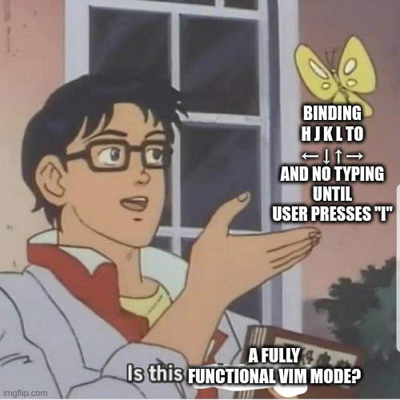

It's common for online code editors (LeetCode, CoderPad, CodeSignal, etc.) and IDEs to offer "Vim
and Emacs modes", and since I'm most comfortable working with the Vim keybinds, I usually turn them
on. When I sat down for a technical interview the other day and attempted to use the Vim features
that my hands take for granted, however, I ran into some behaviors I didn't expect - features
misbehaving such as visual-mode find and replace, interactive find and replace, and even jumping
from one parenthesis to its partner with `%`.

I wondered how complete these online "Vim modes" really are, and I took it upon myself to create a
rubric and begin to assign scores.

## Caveats:

- I access the web via up-to-date Firefox with [uBlock Origin](https://ublockorigin.com/) and
  [PrivacyBadger](https://privacybadger.org/). From time to time a web site does not work as
  expected by its designers with this setup. When a Vim feature appeared to "try to work" but was
  broken in my testing, I noted it as "broken" rather than "missing", but I didn't investigate the
  cause of the failure further.
  
- I fully concede that just because a web site advertises a "Vim mode" doesn't mean it has promised
  to ship a fully functional Vim! I'm not trying to roast these sites for not having these features.
  I'm only exploring what Vim features are and are not present in these editors' Vim modes, because
  I am curious.
  
- My assignment of "importance points" to the various Vim features that I discussed are obviously
  arbitrary, as are the categories themselves, and no doubt there are important Vim features that I
  failed to test. (No doubt there are important Vim features that I don't even know about!) If I
  didn't score your favorite feature or web IDE, please feel free to [reach
  out](/pages/contact.html) and I can update this post.
  
- I didn't test Vim features that don't make sense in the context of a non-Vim IDE, such as netrw (its directory
  explorer, `:Explore`), splitting panes, and opening tabs.
  
- I'm human and can be inconsistent. I had to make judgment calls about how to handle scoring
  certain idiosyncrasies. For example, I gave no points to HackerRank when finding that jumping from
  a parenthesis to its partner doesn't work when jumping backwards in its editor, even though it
  does work in the forward direction. When finding, however, that Neetcode.io editor's Visual Block
  mode works to some extent, but doesn't allow replacing in the visual block with `r` as Vim does, I
  awarded points for that feature anyway since (to me) 95% of the feature's utility was there.
  
- I don't know the Emacs keybinds well enough to grade them, sorry! If you want to hit me with a
  rubric of desired features and instructions for testing, I'd be happy to collaborate on a
  follow-up blog post.

## Methodology:

I decided on thirteen semi-important (at least, I use them all regularly) but non-trivial Vim
features to test. I assigned them "importance points" based on my subjective judgment of how often I
guessed I used them.

| Feature                                                      | Importance points |
|--------------------------------------------------------------|-------------------|
| Deleting something pops it into your "paste" buffer          | 2                 |
| Selecting (visual mode) inside parentheses with `v i (`      | 2                 |
| Repeating a recent action with `.`                           | 3                 |
| Doing `{number} {action}` does `{action}` that many times    | 2                 |
| Visual Block mode                                            | 1                 |
| `/` searches                                                 | 4                 |
| Jumping from a parenthesis to its partner with `%`           | 1                 |
| `:%s` and `:s` find and replace                              | 2                 |
| Interactive find and replace (e.g. `s/foo/bar/gc`)           | 2                 |
| Find and replace with regex (`s/^/- `)                       | 1                 |
| Find and replace with capture groups (e.g. `s/”\(.*\)”/\1/`) | 1                 |
| Command history (e.g. find and replace, search)              | 2                 |
| Misc special actions, e.g. `g g`, `c f :`, `z z`             | 3                 |
| Macros (with e.g. `q q`)                                     | 2                 |
| Total score possible                                         | 28                |

It turned out, though, that four of these items - the first four on my list - were perfectly
implemented across my sample - every site that I tested was able to deliver these features. So, I
won't discuss those points anymore. For every item from "Visual Block mode" on down, at least one
site or IDE that I tested, failed to deliver it.

I tested the Vim modes of the following sites and IDEs:

- Leetcode
- Neetcode
- Codesignal
- Repl.it
- Coderpad.io
- HackerRank
- Codewars.com
- PyCharm with IdeaVim
- VS Code with vscodevim

(The two IDEs were a bit of an afterthought, since I realized they have "Vim modes" too and I was
curious how they held up).

## Results

There was, satisfyingly, exactly one perfect score: Pycharm. Second place was a three-way tie
between applications that delivered every feature I tested, except for find and replace with capture
groups: repl.it, Codewars.com, and VS Code + vscodevim. The site that delivered the fewest Vim
features was HackerRank.

In a surprising number of cases, features were apparently present, but broken! For instance,
Leetcode appears to try to support macro recording and replaying - attempting to record a macro to
the "r" key with `q r` in Leetcode updates the mode line to read `--NORMAL--(recording)[r]`, and
closing the recording and, in some cases, executing it, all works as expected. But my default macro
test was to record a macro of myself typing "foo bar baz", and Leetcode fails to record this as a
macro; instead it inserts only the last letter of the inserted string.

Here are the detailed results. (My tabular notes are
[here](https://gist.github.com/BenQuigley/bde5e34798d8683eb0b3e24565656705) if you have a question
that's not answered by the discussion below).

### Leetcode (22 points)

Delivered everything except:

- Interactive find and replace (e.g. `s/foo/bar/gc`) (which is supposed to open an interactive
  dialog where you answer `y / n / {other options}` for each replacement candidate).
- Find and replace with capture groups (e.g. `s/"\(.*\)"/\1/` - this is supposed to store the
  replaced items for output, for example that expression would replace any string stored in quotes,
  with the string by itself).
- Command history (e.g. find and replace, search, and other commands in Vim each store a history, so
  its same location in the text, but now in the middle of the window pane)
- The special action `z z` (which is supposed to update the buffer location so that the cursor is at
  its same location in the text, but now in the middle of the window pane)
- Macros (with e.g. `q q`). As I mentioned above, this is present but in a broken state on
  Leetcode.com as of right now, on my machine at least.

### Neetcode (23.5 points)

Delivered everything except:

- Find and replace with capture groups
- Command history
- The special action `z z`

### Codesignal (23 points)

Delivered everything except:

- Interactive find and replace - the `s/foo/bar/gc` command did open a dialog, but it didn't accept
  input on my machine, and the editor entered a broken state.
- Find and replace with capture groups
- Command history
- The special action `z z`
- Macros

### Repl.it (27 points)

Great result - delivered everything except find and replace with capture groups.

### Coderpad.io (21 points)

Delivered everything except:

- Jumping from a parenthesis to its partner with `%` - this worked in one direction, forwards, but
  not the other way around!
- Interactive find and replace - like with Codesignal, the `s/foo/bar/gc` command did open a dialog
  but not a working one; unlike with Codesignal the dialog was at least exitable without reloading
  the entire page.
- Find and replace with capture groups
- Command history
- The special action `z z`
- Macros

### HackerRank (18 points)

Delivered everything except:

- Visual Block mode (interestingly, the only IDE I tested that did not deliver this - for reference,
  Ctrl + V enters a visual mode that's distinct from both regular visual mode and linewise visual
  mode; where arbitrary rectangles of text can be selected and operated on).
- Find and replace with `s/foo/bar` in Visual mode (`%s/foo/bar` replacements worked fine, so
  partial credit).
- Interactive find and replace (instead launches a search; does not break page at all)
- Find and replace with capture groups
- Command history
- The special action `z z`
- Macros

### Codewars.com (27 points)

Same as repl.it, great result - delivered everything except find and replace with capture groups.

### PyCharm + IdeaVim (28 points)

The only perfect score! Everything I tested worked.

### VS Code + vscodevim (27 points)

Same as repl.it and Codewars, great result - delivered everything except find and replace with capture groups.
